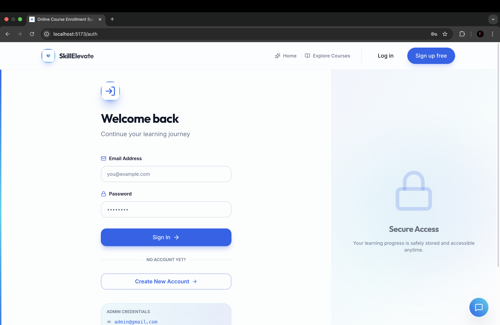
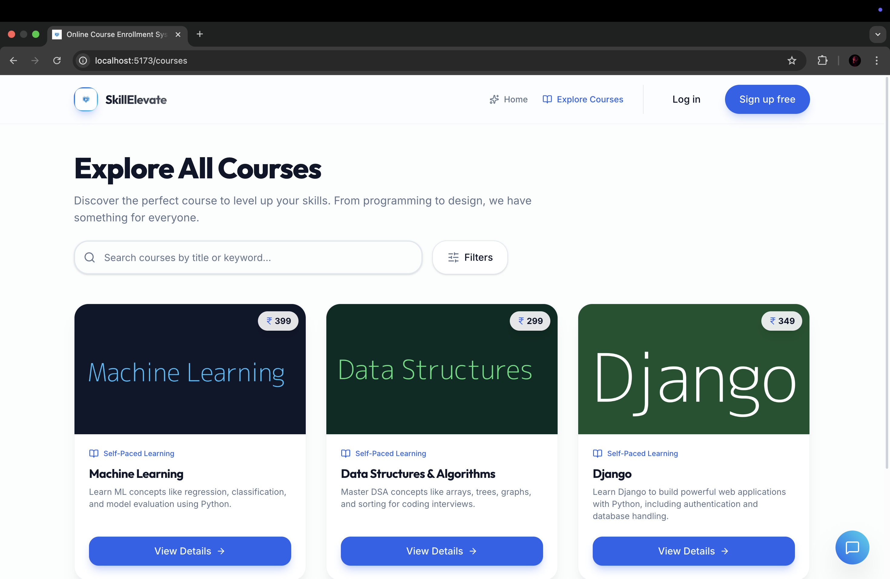
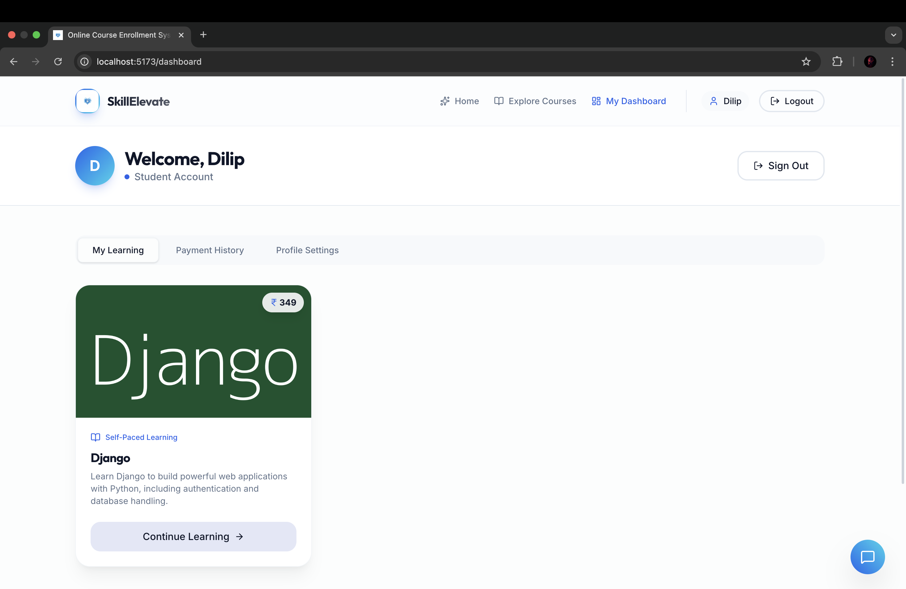
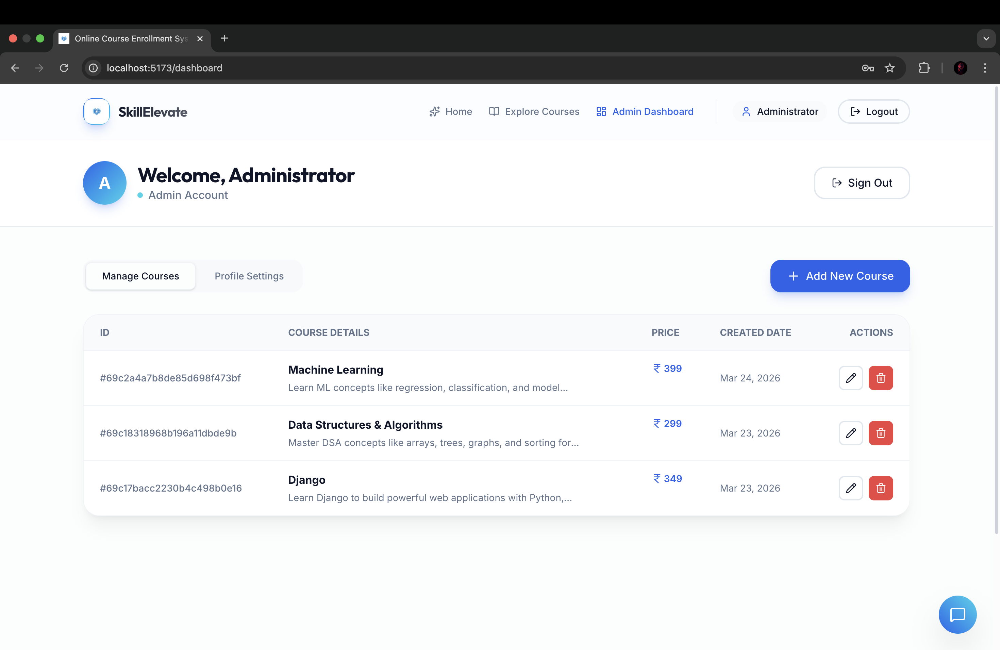
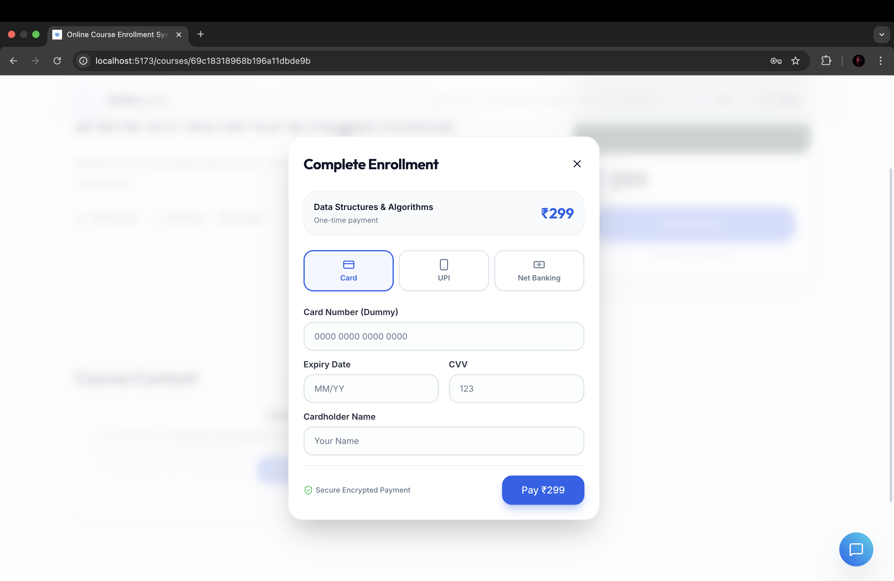

# 📚✨ LearnHub – Online Course Enrollment Platform

**LearnHub** is a full-stack web application that allows users to explore courses, make secure payments, and get enrolled instantly.  
It demonstrates real-world system design using **Strategy Pattern (Payments)** and **Factory Pattern (Authentication)** with a scalable architecture.

<div align="center">
🚀 Learn • Pay • Enroll • Grow  
👨‍💻 Developed by <strong>Dilip Das M Nayaka</strong>  
</div>

---

## 🚀 Key Features

- 🔐 User & Admin Authentication
- 👨‍🎓 Separate Login (User / Admin)
- 📚 Course Listing & Details
- 💳 Multiple Payment Methods:
  - UPI
  - Credit Card
  - Net Banking
  - QR Code Scan
- ⚡ Instant Enrollment after Payment
- 📧 Email Notification (SMTP)
- 👨‍💼 Admin Dashboard (Manage Courses & Users)
- 📱 Fully Responsive UI
- 🔄 Real-Time Payment Flow
  
---

## 🧠 Design Patterns Used

### 🔷 Strategy Pattern (Payment System)

Used to handle different payment methods dynamically.

✔ Each payment method is a separate class:
- UPI Payment
- Credit Card Payment
- Net Banking Payment
- QR Code Payment  

➡️ Eliminates complex if-else conditions  
➡️ Easy to add new payment methods  


### 🏭 Factory Pattern (Authentication System)

Used to create role-based login handlers.

✔ Admin Login Handler  
✔ User Login Handler  

➡️ Clean separation of logic  
➡️ Avoids duplication  
➡️ Scalable for new roles  

---

## 🤖 AI Assistant Chatbot

SkillElevate includes an intelligent chatbot that helps users with:

  - Course details  

  - Price queries  

  - Payment-related help  

  - Feedback and support from admin  

This improves user experience and reduces manual support effort.

---

## 🖼️ Screenshots

### 🏠 Home Page


### 🔐 Login Page


### 📚 Courses Page


### 👤 User Dashboard


### 🛠️ Admin Dashboard


### 💳 Payment Page


---

## 🗂️ Project Structure

```
learnhub/
├── lib/
│   ├── api-client-react/
│   ├── api-zod/
│   └── db/
│
├── project/
│   ├── backend/
│   │   ├── src/
│   │   │   ├── models/
│   │   │   ├── routes/
│   │   │   ├── controllers/
│   │   │   ├── middleware/
│   │   │   └── lib/
│   │   └── scripts/
│   │
│   ├── frontend/
│   │   ├── src/
│   │   │   ├── pages/
│   │   │   ├── components/
│   │   │   └── services/
│   │   └── public/
│
├── screenshots/
├── package.json
└── README.md
```

---

## 🛠️ Tech Stack

| Layer | Technology |
|------|------------|
| **Frontend** | React, TypeScript, Vite |
| **Backend** | Node.js, Express |
| **Database** | MongoDB, Mongoose |
| **Authentication** | JWT |
| **Payments** | Strategy Pattern |
| **Email** | SMTP (Gmail) |
| **Architecture** | Factory + Strategy Design Patterns |

---

## ⚙️ Environment Variables

### 🔹 Backend `.env`
```
PORT=3001
MONGODB_URI=your_mongodb_connection_string

ADMIN_EMAIL=admin@gmail.com
ADMIN_PASSWORD=admin123

SMTP_HOST=smtp.gmail.com
SMTP_PORT=587
SMTP_USER=your_email@gmail.com
SMTP_PASS=your_app_password
SMTP_SECURE=false
```

---

### 🔹 Frontend `.env`
```
PORT=5173
BASE_PATH=/
VITE_API_URL=http://localhost:3001
```

---
## ▶️ How to Run the Project (pnpm + ngrok)

### 1️⃣ Install pnpm (if not installed)
```bash
npm install -g pnpm
```

---

### 2️⃣ Install Dependencies

From the root folder:

```bash
pnpm install
```

---

### 3️⃣ Start Backend Server

```bash
cd project/backend

export BACKEND_PUBLIC_URL="https://your-ngrok-url.ngrok-free.app"
PORT=3001 pnpm --filter @workspace/api-server dev
```

---

### 4️⃣ Start Frontend

```bash
cd project/frontend

BASE_PATH=/ PORT=5173 pnpm --filter @workspace/course-enrollment dev
```

---

### 5️⃣ Start ngrok (Required for QR Payment)

Open a new terminal:

```bash
ngrok http 3001
```

👉 Copy the generated URL:
```
https://abcd1234.ngrok-free.app
```

👉 Update backend environment:
```bash
export BACKEND_PUBLIC_URL="https://abcd1234.ngrok-free.app"
```

---

## 🌐 Access the Application

- Frontend: http://localhost:5173  
- Backend: http://localhost:3001  

---

## ⚠️ Important Notes

- Run **backend, frontend, and ngrok in separate terminals**
- Always update `BACKEND_PUBLIC_URL` when ngrok restarts
- Ensure pnpm workspace is configured correctly
- QR payments will not work without ngrok

---

## 🔌 API Endpoints

### Authentication
```
POST /api/auth/register
POST /api/auth/login/admin
POST /api/auth/login/user
GET  /api/auth/me
```

### Courses
```
GET /api/courses
POST /api/courses
```

### Payments
```
POST /api/payments/process
POST /api/payments/complete-qr
```

---

## 🎯 Future Enhancements

- 📱 Mobile App (React Native)
- 💬 Chat System
- 📊 Analytics Dashboard
- 💳 Real Payment Gateway Integration
- 🔔 Push Notifications

---

## 👨‍💻 Developer

👨‍💻 **Dilip Das M Nayaka**

---

## ⭐ Support

If you like this project:

⭐ Star the repository  
🍴 Fork it  
📢 Share it  

---

## 🚀 LearnHub — Learn Smarter, Grow Faster
> 🎯 This project demonstrates real-world implementation of scalable architecture using design patterns in a full-stack system.
